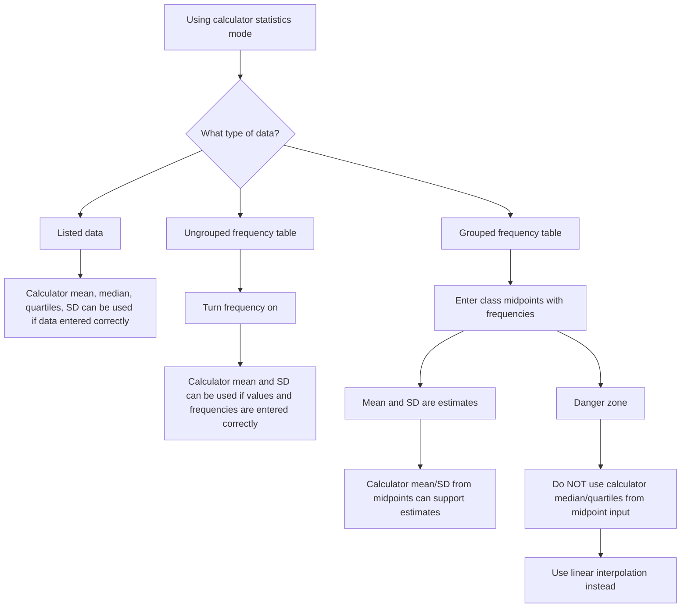

# AS2MeasuresLocationSpreadMermaid-009

## Asset ID
`AS2MeasuresLocationSpreadMermaid-009`

## Purpose
Warn students which calculator outputs are safe and which are dangerous for grouped data.

```mermaid
flowchart TD
    A["Using calculator statistics mode"] --> B{"What type of data?"}
    B --> C["Listed data"]
    C --> D["Calculator mean, median, quartiles, SD can be used if data entered correctly"]
    B --> E["Ungrouped frequency table"]
    E --> F["Turn frequency on"]
    F --> G["Calculator mean and SD can be used if values and frequencies are entered correctly"]
    B --> H["Grouped frequency table"]
    H --> I["Enter class midpoints with frequencies"]
    I --> J["Mean and SD are estimates"]
    J --> K["Calculator mean/SD from midpoints can support estimates"]
    I --> L["Danger zone"]
    L --> M["Do NOT use calculator median/quartiles from midpoint input"]
    M --> N["Use linear interpolation instead"]
```
