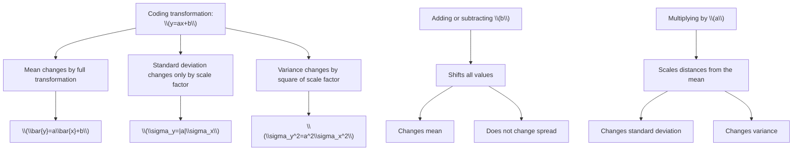

# AS2MeasuresLocationSpreadMermaid-010

## Asset ID
`AS2MeasuresLocationSpreadMermaid-010`

## Purpose
Show the effect of the transformation y = ax + b on mean, standard deviation and variance.

```mermaid
flowchart TD
    A["Coding transformation:<br/>\\(y=ax+b\\)"] --> B["Mean changes by full transformation"]
    A --> C["Standard deviation changes only by scale factor"]
    A --> D["Variance changes by square of scale factor"]
    B --> E["\\(\\bar{y}=a\\bar{x}+b\\)"]
    C --> F["\\(\\sigma_y=|a|\\sigma_x\\)"]
    D --> G["\\(\\sigma_y^2=a^2\\sigma_x^2\\)"]
    H["Adding or subtracting \\(b\\)"] --> I["Shifts all values"]
    I --> J["Changes mean"]
    I --> K["Does not change spread"]
    L["Multiplying by \\(a\\)"] --> M["Scales distances from the mean"]
    M --> N["Changes standard deviation"]
    M --> O["Changes variance"]
```
