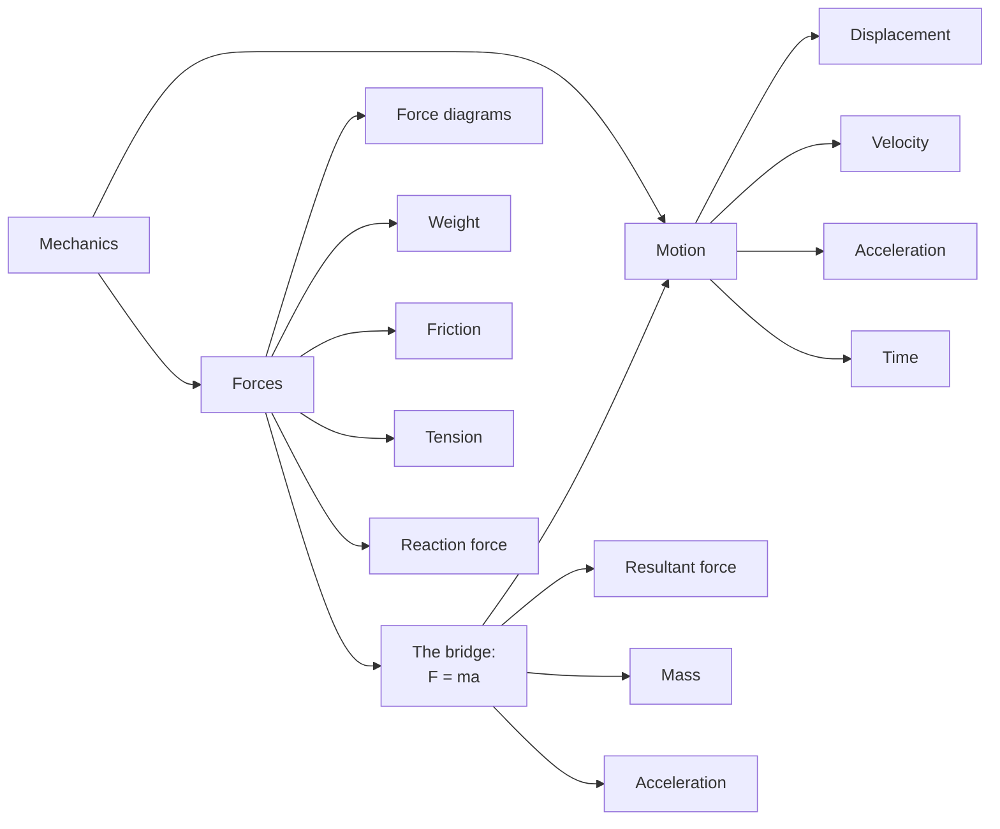

# AS2ModellingInMechanicsMER-001

## Asset metadata

- asset_id: AS2ModellingInMechanicsMER-001
- lesson_id: AS2ModellingInMechanics
- related_placeholder: AS2ModellingInMechanicsSVG-001
- source: MechYr1-Chp8-Introduction.pdf, page 3
- related lesson section: Big Picture Explanation
- purpose: Show mechanics as the study of motion, forces and the bridge between them through Newton's second law.

