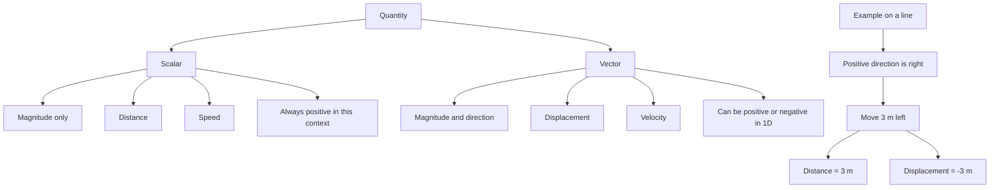

# AS2ModellingInMechanicsMER-002

## Asset metadata

- asset_id: AS2ModellingInMechanicsMER-002
- lesson_id: AS2ModellingInMechanics
- related_placeholder: AS2ModellingInMechanicsSVG-002
- source: MechYr1-Chp8-Introduction.pdf, page 6
- related lesson section: Key Definitions and Notation
- purpose: Show the distinction between scalar distance and vector displacement, including one-dimensional signed displacement.

