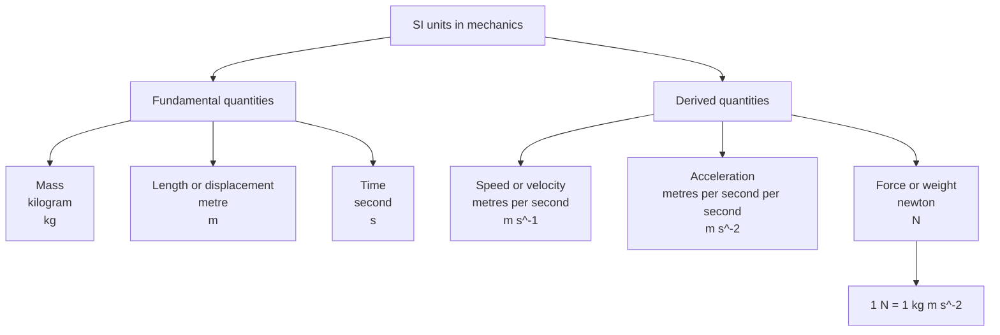

# AS2ModellingInMechanicsMER-003

## Asset metadata

- asset_id: AS2ModellingInMechanicsMER-003
- lesson_id: AS2ModellingInMechanics
- related_placeholder: AS2ModellingInMechanicsSVG-003
- source: MechYr1-Chp8-Introduction.pdf, page 5
- related lesson section: Core Theory, SI Units
- purpose: Present fundamental and derived SI units used in AS2 mechanics.

