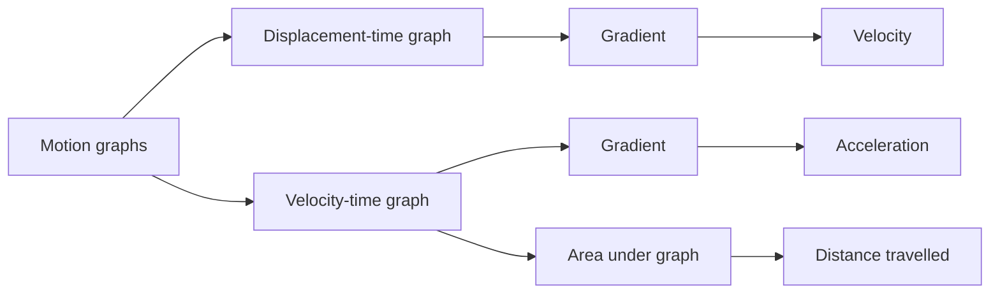

# AS2ModellingInMechanicsMER-004

## Asset metadata

- asset_id: AS2ModellingInMechanicsMER-004
- lesson_id: AS2ModellingInMechanics
- related_placeholder: AS2ModellingInMechanicsSVG-004
- source: MechYr1-Chp8-Introduction.pdf, page 3
- related lesson section: Core Theory, Motion Graphs
- purpose: Show the interpretation of gradients and areas in displacement-time and velocity-time graphs.

