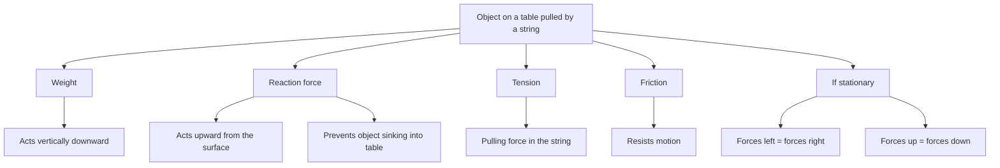

# AS2ModellingInMechanicsMER-005

## Asset metadata

- asset_id: AS2ModellingInMechanicsMER-005
- lesson_id: AS2ModellingInMechanics
- related_placeholder: AS2ModellingInMechanicsSVG-005
- source: MechYr1-Chp8-Introduction.pdf, page 3
- related lesson section: Core Theory, Force Vocabulary
- purpose: Summarise common forces acting on an object on a table.

