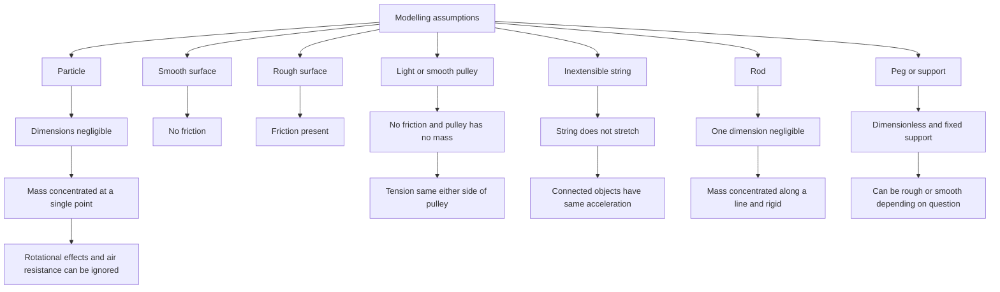

# AS2ModellingInMechanicsMER-006

## Asset metadata

- asset_id: AS2ModellingInMechanicsMER-006
- lesson_id: AS2ModellingInMechanics
- related_placeholder: AS2ModellingInMechanicsSVG-006
- source: MechYr1-Chp8-Introduction.pdf, page 4; transcript modelling assumptions section
- related lesson section: Core Theory, Modelling Assumptions
- purpose: Link each modelling assumption to its meaning and calculation consequence.

