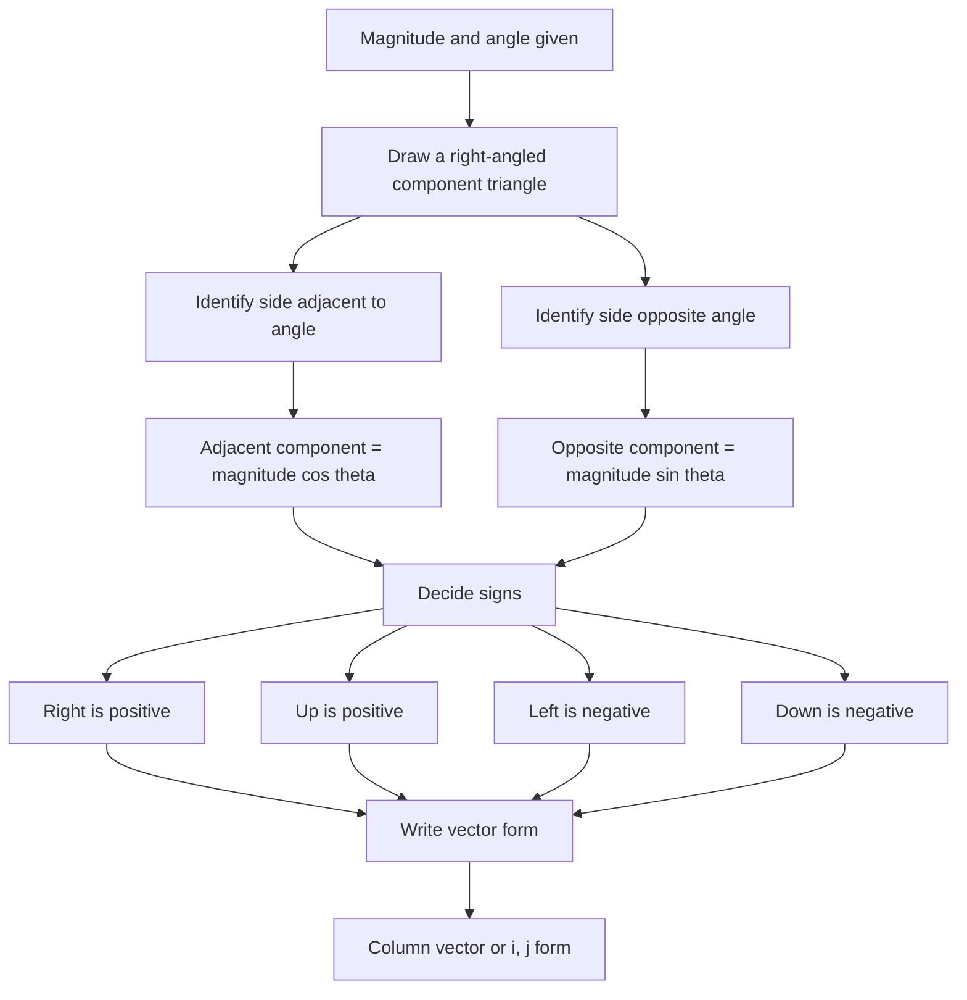

# AS2ModellingInMechanicsMER-007

## Asset metadata

- asset_id: AS2ModellingInMechanicsMER-007
- lesson_id: AS2ModellingInMechanics
- related_placeholder: AS2ModellingInMechanicsSVG-007
- source: MechYr1-Chp8-Introduction.pdf, pages 7 to 8; transcript scalar-to-vector examples
- related lesson section: Worked Examples
- purpose: Show the process for converting magnitude and direction into vector components.

