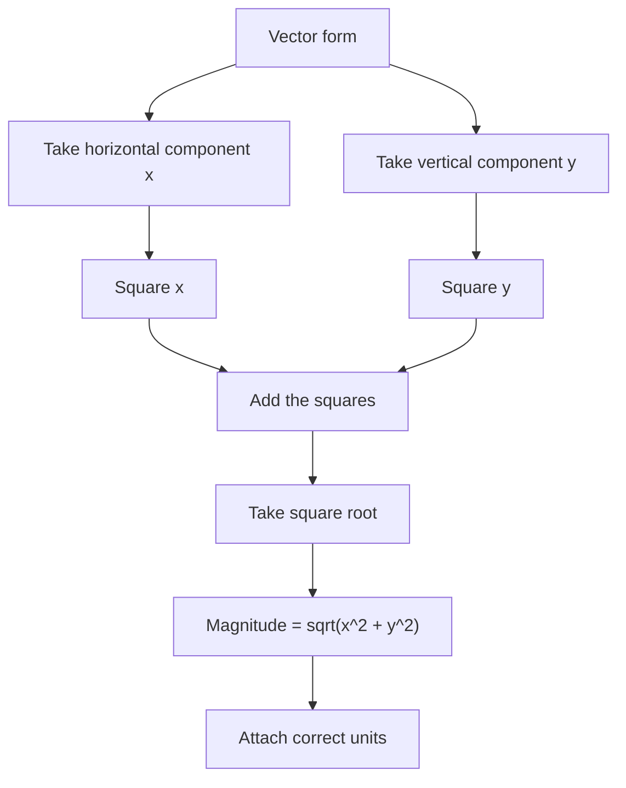

# AS2ModellingInMechanicsMER-008

## Asset metadata

- asset_id: AS2ModellingInMechanicsMER-008
- lesson_id: AS2ModellingInMechanics
- related_placeholder: teaching enhancement
- source: MechYr1-Chp8-Introduction.pdf, pages 7 to 9
- related lesson section: Worked Examples and Exam Technique
- purpose: Show how to convert vector form into scalar magnitude.

