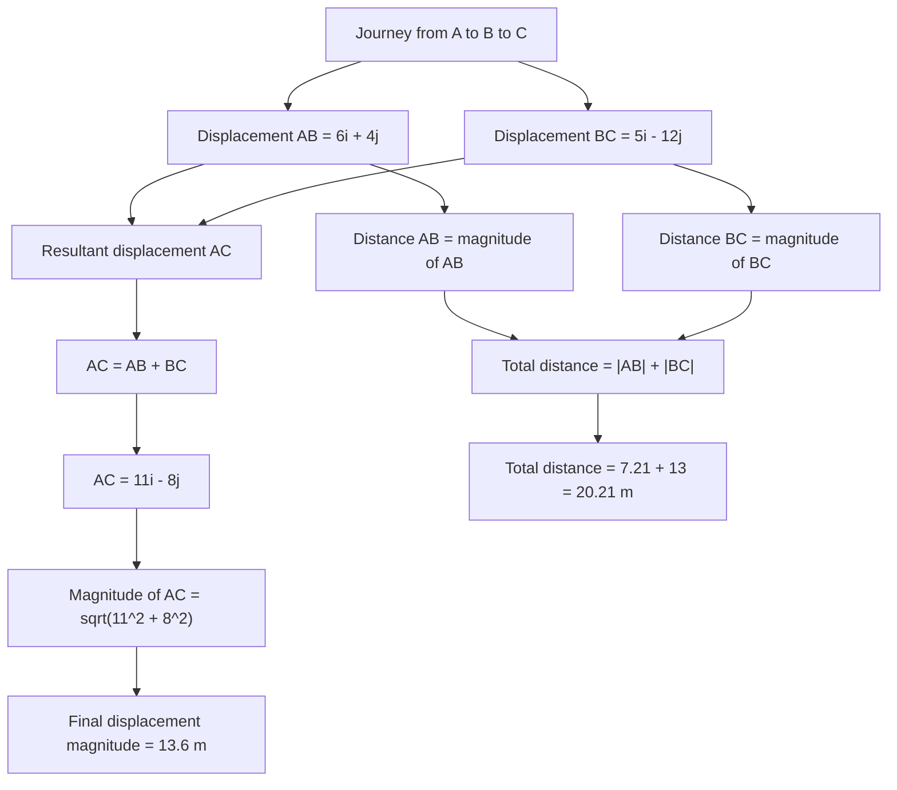

# AS2ModellingInMechanicsMER-009

## Asset metadata

- asset_id: AS2ModellingInMechanicsMER-009
- lesson_id: AS2ModellingInMechanics
- related_placeholder: teaching enhancement
- source: MechYr1-Chp8-Introduction.pdf, page 9; transcript modelling with vectors section
- related lesson section: Worked Example 7
- purpose: Show the difference between resultant displacement and total distance travelled.

