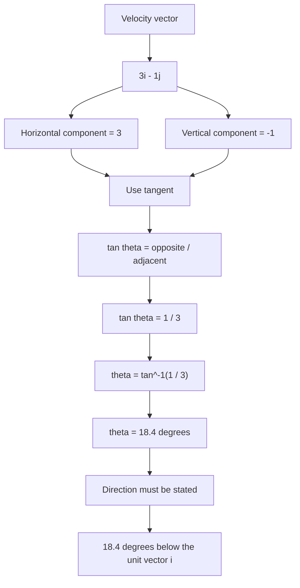

# AS2ModellingInMechanicsMER-010

## Asset metadata

- asset_id: AS2ModellingInMechanicsMER-010
- lesson_id: AS2ModellingInMechanics
- related_placeholder: teaching enhancement
- source: MechYr1-Chp8-Introduction.pdf, page 9; transcript raccoon example
- related lesson section: Worked Example 8
- purpose: Show how to find the angle a velocity vector makes with the unit vector i.

