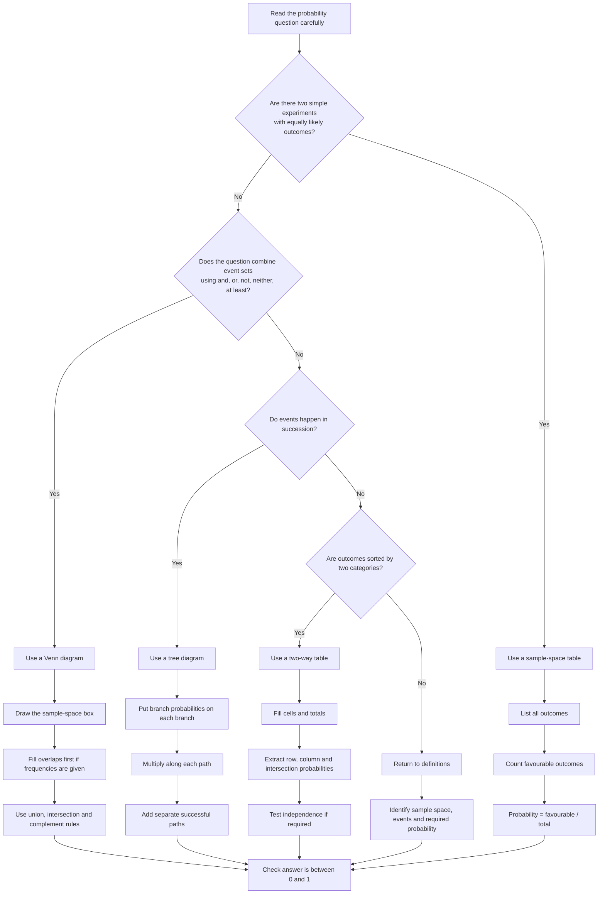

# AS2ProbabilityMermaid-001

## Asset Metadata

| Field | Value |
|---|---|
| Asset ID | AS2ProbabilityMermaid-001 |
| Asset type | Mermaid flowchart |
| Source | CCEA AS2 Probability specification map plus Phase 1 lesson plan |
| Related lesson section | Core Theory; Exam Technique Notes |
| Purpose | Help the student choose the right probability representation: sample-space table, Venn diagram, tree diagram or two-way table. |

