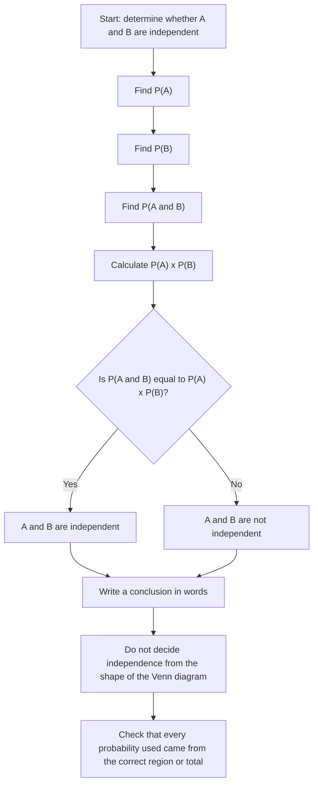

# AS2ProbabilityMermaid-002

## Asset Metadata

| Field | Value |
|---|---|
| Asset ID | AS2ProbabilityMermaid-002 |
| Asset type | Mermaid flowchart |
| Source | CCEA AS2 Probability specification map plus DrFrost independent-events evidence |
| Related lesson section | Independent and Dependent Events; Exam Technique Notes |
| Purpose | Show the exact decision process for testing whether two events are independent. |

