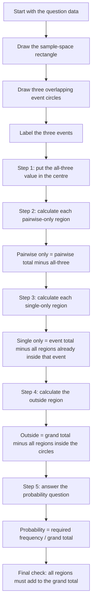

# AS2ProbabilityMermaid-003

## Asset Metadata

| Field | Value |
|---|---|
| Asset ID | AS2ProbabilityMermaid-003 |
| Asset type | Mermaid flowchart |
| Source | DrFrost three-set Venn diagram examples plus Phase 1 worked examples |
| Related lesson section | Venn Diagrams with Frequencies; Worked Examples; Common Mistakes and Exam Traps |
| Purpose | Show the centre-outwards method for filling a three-set Venn diagram. |

