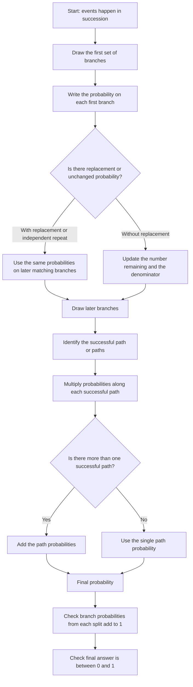

# AS2ProbabilityMermaid-004

## Asset Metadata

| Field | Value |
|---|---|
| Asset ID | AS2ProbabilityMermaid-004 |
| Asset type | Mermaid flowchart |
| Source | DrFrost tree diagram evidence plus CCEA AS2 Probability specification map |
| Related lesson section | Tree Diagrams; Worked Examples; Exam Technique Notes |
| Purpose | Show the calculation logic for tree diagrams: multiply along paths and add separate successful paths. |

