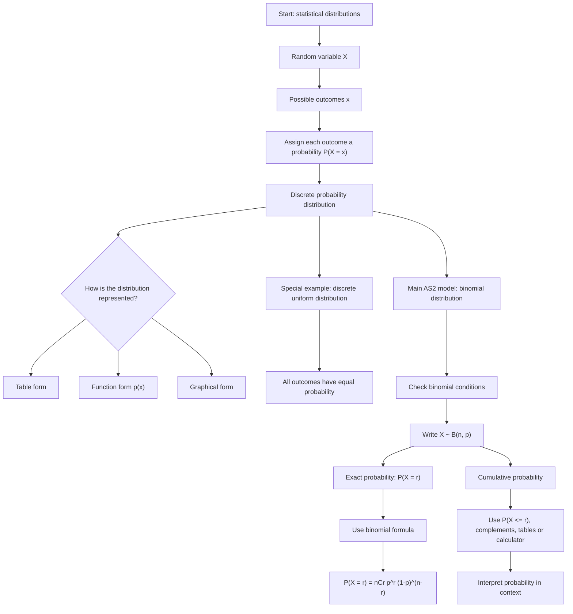

# AS2StatisticalDistributionsMermaid-001

**Asset ID:** AS2StatisticalDistributionsMermaid-001  
**Source:** CCEA AS2-DIST specification map + DrFrostMaths Chapter 6 overview  
**Related lesson section:** Big Picture Explanation, Core Theory  
**Purpose:** Show the learning route from random variables to binomial probabilities and cumulative probabilities.

