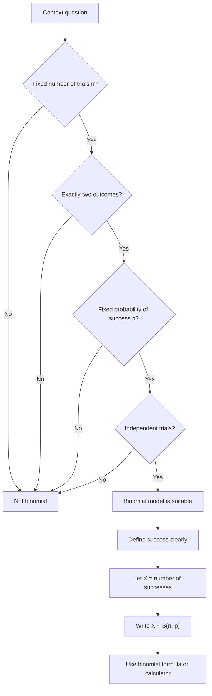

# AS2StatisticalDistributionsMermaid-002

**Asset ID:** AS2StatisticalDistributionsMermaid-002  
**Source:** Teacher transcript section on binomial distribution conditions  
**Related lesson section:** Core Theory 8.4, Common Mistakes and Exam Traps  
**Purpose:** Give students a decision tree for whether a binomial model is appropriate.

