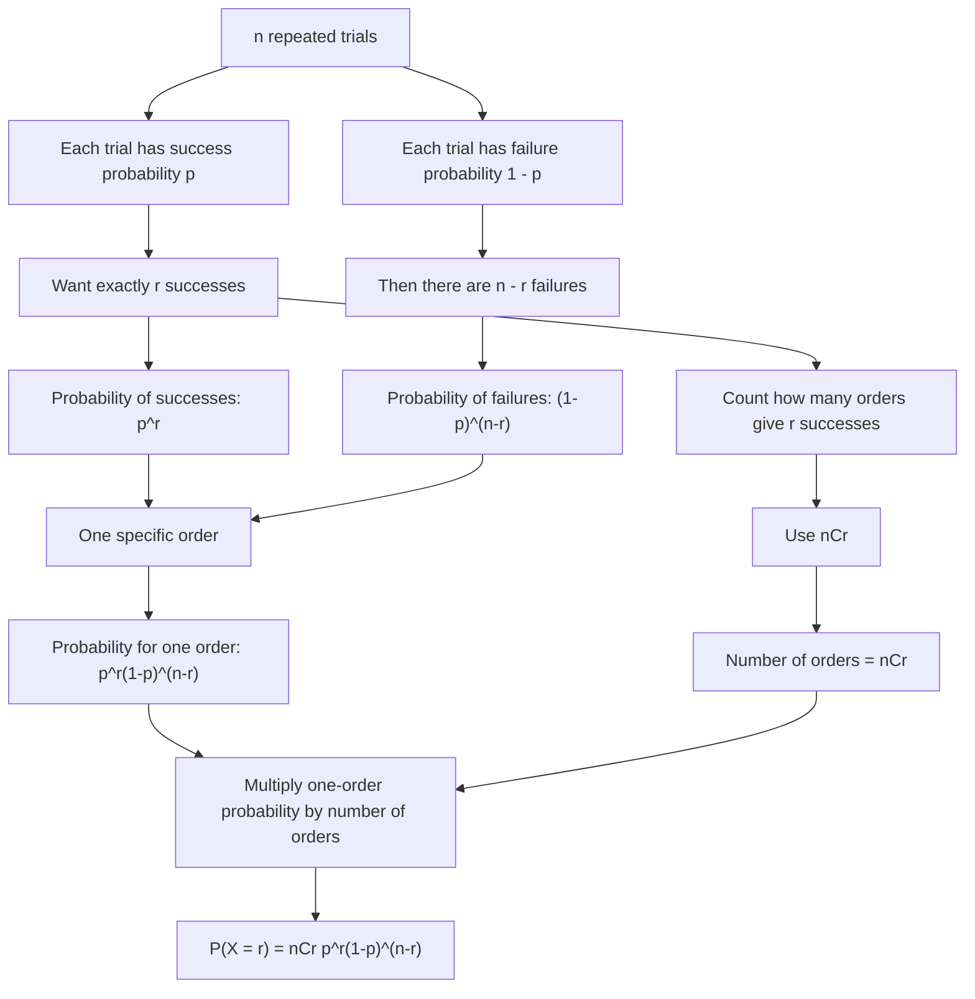

# AS2StatisticalDistributionsMermaid-003

**Asset ID:** AS2StatisticalDistributionsMermaid-003  
**Source:** Transcript explanation linking combinations, binomial coefficients and repeated trials  
**Related lesson section:** Core Theory 8.5, Worked Example 3, Worked Example 5  
**Purpose:** Show how the binomial formula comes from tree/path counting.

