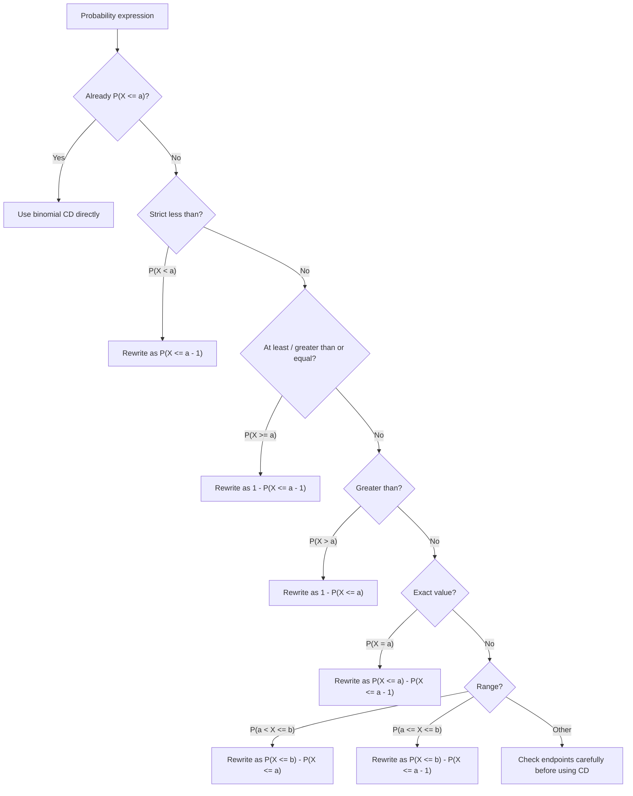

# AS2StatisticalDistributionsMermaid-004

**Asset ID:** AS2StatisticalDistributionsMermaid-004  
**Source:** Slide/transcript evidence on cumulative binomial probability transformations  
**Related lesson section:** Core Theory 8.6, Worked Examples 10-13, Exam Technique Notes  
**Purpose:** Give a clean conversion map for turning probability wording into calculator/table-friendly cumulative form.

