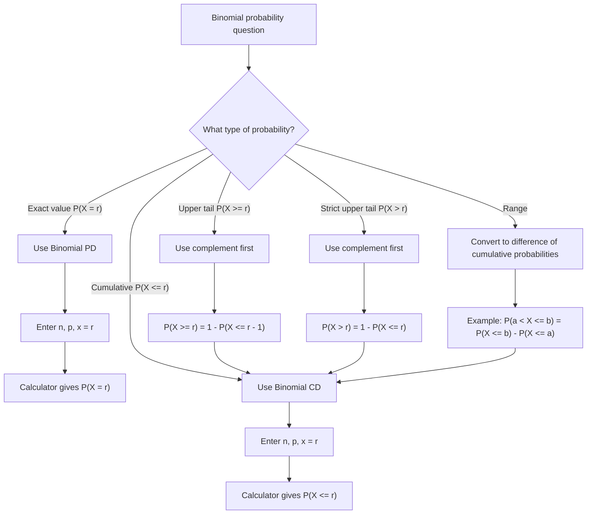

# AS2StatisticalDistributionsMermaid-005

**Asset ID:** AS2StatisticalDistributionsMermaid-005  
**Source:** Transcript calculator guidance for binomial probability distribution and cumulative distribution  
**Related lesson section:** Exam Technique Notes  
**Purpose:** Help students choose between exact binomial probability mode and cumulative binomial mode.

