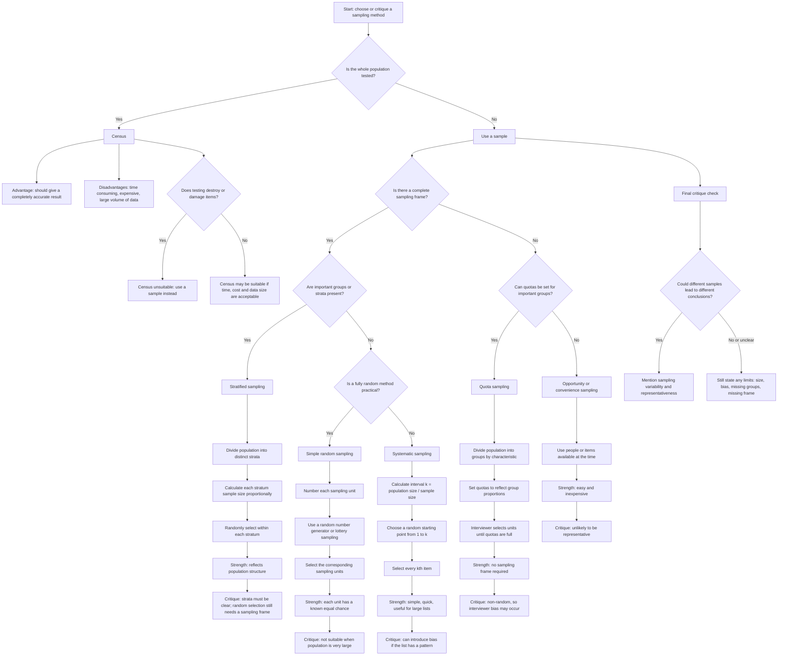

# AS2StatisticalSamplingMER-001

## Asset Metadata

**Asset ID:** AS2StatisticalSamplingMER-001  
**Unit code:** AS2  
**Topic code:** AS2-SAMP  
**Topic name:** Statistical sampling  
**Topic ID:** AS2StatisticalSampling  
**Asset type:** Mermaid flowchart  
**Related lesson section:** Visual Asset Integration; Core Theory; Exam Technique Notes  
**Source:** CCEA AS2 Statistical sampling specification boundary + supplied Data Collection PDF/transcript evidence  
**Purpose:** Decision flowchart for choosing or critiquing a sampling method based on whether there is a sampling frame, whether the population has important strata, whether randomness is possible, and whether speed/convenience is prioritised.  
**Linked LO IDs:** AS2-SAMP-LO003, AS2-SAMP-LO004

## Off-Spec Control Note

Systematic, quota and opportunity sampling are included as supporting method-selection and critique vocabulary because they appear in the supplied evidence. The named CCEA core methods remain simple random sampling and stratified sampling.
